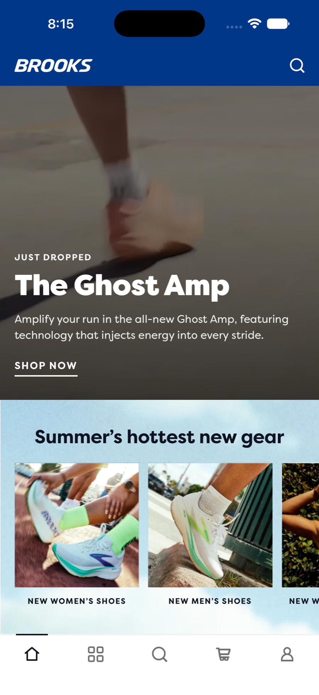
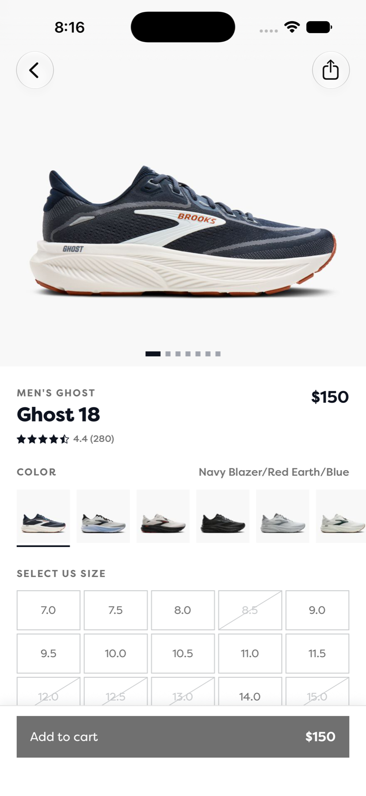

# Brooks mobile commerce prototype

A working mobile shopping prototype inspired by [Brooks Running](https://www.brooksrunning.com), built with Expo SDK 57 and React Native 0.86. It uses real Brooks products and photography for the full browse-to-cart journey. Checkout stops inside the app, and no order is placed.

| Home | Product details |
| --- | --- |
|  |  |

## What works

- Home mirrors the current Brooks campaign with the Ghost Amp video hero, product rails, editorial cards, and the "Longer days. Longer runs." feature.
- Browse covers categories and franchises. Its search field swaps the screen into live Constructor.io results, with suggestions, filters, sorting, and an on-device fallback when the service is unavailable.
- Shoe Finder runs a 16-step fit and preference quiz, then ranks products from the bundled catalog.
- Product details include a swipeable gallery, colorways, widths, per-size availability, specifications, fit data, reviews, and a persistent add-to-cart flow.
- Cart supports quantity changes, swipe-to-remove with undo, totals, and persisted items. Checkout displays the prototype boundary instead of contacting Brooks.
- Brooks Run Club membership is a local demo state. Names and email addresses stay on the device.
- The app uses native stack headers and sheets, an app-owned five-tab bar, reduced-motion behavior, and Apple zoom transitions on iOS 18 and newer.

The repository has iOS, Android, and web scripts. The current store-delivery workflow is iOS-only.

## Quick start

You will need [Bun 1.2.22](https://bun.sh) and the native tooling for the platform you plan to run. Expo SDK 57 targets Node 22.13 or newer, React Native 0.86, Xcode 26.4 or newer, iOS 16.4 or newer, and Android API 36. See the [versioned Expo SDK 57 requirements](https://docs.expo.dev/versions/v57.0.0/#each-expo-sdk-version-depends-on-a-react-native-version).

Install dependencies and build a local iOS development client:

```sh
bun install
bun run ios
```

Other targets:

```sh
bun run android
bun run web
```

The native `ios/` and `android/` directories are generated locally and ignored by Git. `expo run:ios` and `expo run:android` create them on the first build.

If a development build is already installed, start Metro without rebuilding:

```sh
bun run start
```

Because this project includes `expo-dev-client`, that command targets the development build. To open the project in Expo Go instead, force that launch target:

```sh
bunx expo start --go
```

## Checks

Run the TypeScript check before sending a change:

```sh
bun run typecheck
```

There is no Jest, Detox, or other automated app test suite in this repository yet. Core flows require interactive checks on the target platforms.

## How the data works

The app combines bundled, live, and device-local data:

| Data | Source | Runtime behavior |
| --- | --- | --- |
| Products, variants, prices, stock, and specifications | `packages/catalog/catalog.json` | Bundled and available offline |
| Ratings, fit summaries, and recent reviews | `packages/catalog/reviews.json` | Bundled and available offline |
| Search and suggestions | Brooks's Constructor.io index | Live, with local fallback |
| Product and campaign photography | Brooks image CDN | Loaded live |
| Cart and Run Club demo state | `expo-sqlite` key-value storage | Stored only on the device |

The current catalog snapshot was captured on July 13, 2026. It contains 226 products, 821 colorways, prices, and per-size stock. Review data for all 226 products was refreshed on August 21, 2026.

`brooksrunning.com` sits behind Akamai Bot Manager and returns `403` to non-browser clients. The app therefore cannot call Brooks product, authentication, or cart endpoints directly. [LLP 0002](./llp/0002-brooks-commerce-api.research.md) documents the browser research, reachable services, request shapes, and the exact cart variant identifiers.

`packages/catalog` is the source of truth. Files in `src/data/` and `assets/catalog.json` are generated copies. Do not edit those copies by hand.

## Refreshing the catalog

Install the harvester's browser dependencies once:

```sh
cd tools/harvest
bun install
cd ../..
```

Then capture and sync the current catalog:

```sh
bun run harvest
bun run sync
```

To replace every review record instead of filling only missing records:

```sh
bun run harvest:reviews --refresh
bun run sync
```

The harvester drives a real browser because direct HTTP requests are blocked. It is slow, checkpointed, and intentionally keeps request volume low.

## Project map

```text
src/
  app/                 Expo Router routes
  screens/             Screen implementations
  components/          Shared UI and navigation components
  data/                Generated catalog copies and editorial content
  store/               Cart, member, and search state
  theme/               Color, type, spacing, motion, and header tokens
  utils/               Storage, haptics, and formatting
packages/catalog/      Source catalog package and schemas
tools/harvest/         Browser capture, validation, and sync tools
.eas/workflows/        TestFlight delivery workflow
docs/                  README screenshots
llp/                   Product, system, and design rationale
diaries/               AI-agent development records
```

`brand.config.js` owns the shippable app identity. `app.config.ts` overlays it on `app.json`, so the display name, slug, URL scheme, and native identifiers stay together.

## TestFlight

The iOS workflow in [`.eas/workflows/deploy-to-testflight.yml`](./.eas/workflows/deploy-to-testflight.yml) fingerprints the native layer, builds when native inputs change, and otherwise uses a matching build as the base for a repack. The resulting binary goes to TestFlight. The project does not use EAS Update.

Run it manually with an Expo account that has access to the configured EAS and App Store Connect projects:

```sh
eas workflow:run .eas/workflows/deploy-to-testflight.yml
```

The workflow also declares a push trigger for `main`. That trigger remains inactive until this GitHub repository is connected to the EAS project.

## Scope

The prototype is built for product exploration and technical evaluation. It does not send Run Club details to Brooks, share its local cart with brooksrunning.com, submit payment, or place orders. The harvested catalog is a dated prototype fixture, not a production data contract.

## Project documentation

This repository uses [Linked Literate Programming](https://github.com/ccheever/llp) to keep implementation decisions connected to their rationale.

- [LLP 0000: Brooks](./llp/0000-brooks.explainer.md) is the product and system entry point.
- [LLP 0001: Mobile shoe commerce design survey](./llp/0001-mobile-shoe-commerce-design.research.md) records the reference products and evaluation rubric.
- [LLP 0002: The Brooks commerce API](./llp/0002-brooks-commerce-api.research.md) explains the data and network architecture. Read it before changing `src/data/` or `packages/catalog/`.
- [LLP 0003: Brooks design system and screen patterns](./llp/0003-brooks-design-system.research.md) records brand tokens, navigation, motion, and current screen decisions.
- [LLP 0004: Building on Exact today](./llp/0004-building-on-exact.research.md) preserves research from the original monorepo.
- [AGENTS.md](./AGENTS.md) contains working rules for AI agents, including LLP and diary requirements.

Code uses `@ref LLP NNNN#section` comments where a non-obvious implementation decision needs its rationale close by.
